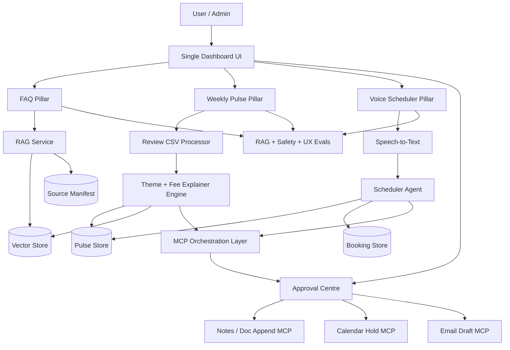

# Mutual Fund Advisor Intelligence Suite

Voice-first AI support assistant for mutual fund users. The system answers facts-only mutual fund questions with citations, analyses user reviews into weekly product insights, books advisor appointments through voice, and routes all external actions through a human approval centre.

> Capstone goal: build a real GenAI system, not a prompt-only demo.

---

## 1. Project Objective

People do not only need to find mutual fund schemes. They need to understand what they are invested in, why charges apply, and who to speak with when they are confused.

This project builds an integrated AI assistant with three connected pillars:

1. **FAQ Chatbot** — facts-only Q&A from verified public sources.
2. **Review Intelligence** — weekly product pulse and fee explainer from recent reviews.
3. **Voice Scheduler** — voice-based advisor booking with context from review insights.

A shared **Approval Centre** controls all MCP actions before they execute. In the product flow, this Approval Centre represents an advisor operations console where an operations user reviews pending actions before any underlying tool runs.

### Important System Design Rule

The Voice Scheduler must never directly create calendar events, write notes, or send emails. It only generates a booking code and asks the MCP Orchestrator to create pending actions. Those actions appear in the Approval Centre, which represents an advisor operations console. An operations user must approve or reject each action before any MCP tool can execute.

```text
Customer
   ↓
Voice Scheduler
   ↓
Booking Code
   ↓
MCP Orchestrator
   ↓
Approval Centre (Operations Console)
   ↓
Approve / Reject
   ↓
Calendar Tool
Notes Tool
Email Draft Tool
```

---

## 2. Current Scope

To keep the graduation project achievable, the first version is scoped to:

- **1 AMC**
- **3–5 mutual fund schemes**
- **30–50 simulated or scraped reviews**
- **8–12 weeks of review dates**
- **Stage 1 mock calendar slots before real MCP calendar integration**
- **Official/public sources only**
- **Minimum 30 source URLs in the source manifest**
- **Single deployed dashboard**

No personalized financial advice will be provided.

---

## 3. Core User Flows

### Flow A — Facts-Only FAQ

User asks:

> What is the exit load for the ELSS fund?

System behavior:

1. Detects whether the scheme is ambiguous.
2. Retrieves official facts from the RAG corpus.
3. Answers in 3 sentences or fewer.
4. Includes at least one citation link.
5. Refuses investment advice and redirects to AMFI education material.

---

### Flow B — Review Intelligence

Admin uploads or selects a reviews CSV.

System generates:

1. **Weekly Product Pulse**
   - Top themes
   - Representative user quotes
   - Key observation
   - Exactly 3 product action ideas
   - Maximum 250 words

2. **Fee Explainer**
   - Exactly 6 bullets
   - Plain-language explanation of the most-confused fee
   - 2 official source links
   - `Last checked: YYYY-MM-DD`

The Fee Explainer is then appended to the FAQ retrieval corpus so future FAQ answers can use the latest confusion insight.

---

### Flow C — Voice Appointment Scheduler

User says:

> I want to book a call about my SIP mandate.

System behavior:

1. Voice agent greets the user using the current top Weekly Pulse theme.
2. User selects or confirms a mock advisor slot.
3. System generates a booking code, for example `KV-B391`.
4. System reads the booking code aloud.
5. MCP Orchestrator creates pending approval actions:
   - Calendar Hold
   - Notes Entry
   - Advisor Email Draft
6. The actions appear in the Approval Centre, acting as an advisor operations console.
7. An operations user approves or rejects each action before the mock MCP tools execute.

No PII is collected during the call. If the user volunteers personal details, the system redirects them to a secure link.

The scheduler does not execute these actions directly. The required flow is: Customer -> Voice Scheduler -> Booking Code -> MCP Orchestrator -> Approval Centre (Operations Console) -> Approve / Reject -> Calendar Tool / Notes Tool / Email Draft Tool.

The frontend voice layer uses Vapi Web SDK. Vapi captures speech and emits final transcripts; the browser sends each final transcript to `POST /scheduler/voice-turn`. The backend response is then displayed in the scheduler view and spoken through Vapi TTS. Business logic is not duplicated in Vapi or the browser.


## How the Three Pillars Work Together

The three pillars are designed as a connected support workflow rather than independent features.

1. **Review Intelligence** analyzes customer reviews and generates a Weekly Product Pulse and Fee Explainer. The Fee Explainer is added back into the RAG corpus, allowing the FAQ Chatbot to answer common fee-related questions more effectively over time.

2. **FAQ Chatbot** uses both official source documents and generated Fee Explainers to provide factual, citation-backed responses. This creates a feedback loop where recurring customer confusion improves future answers.

3. **Voice Scheduler** uses insights from the Weekly Product Pulse to personalize the user experience. For example, the current Top Theme is referenced in the greeting and is included in advisor briefing materials generated through the MCP workflow.

Together, these components create a continuous flow:

```text
Customer Reviews
        ↓
Review Intelligence
        ↓
Weekly Pulse + Fee Explainer
        ↓
 ┌───────────────┴───────────────┐
 ↓                               ↓
FAQ Chatbot              Voice Scheduler
 ↓                               ↓
Better Answers          Context-Aware Booking
                                 ↓
                         MCP Approval Workflow
                                 ↓
                   Calendar / Notes / Email Draft
```

This architecture creates a feedback loop between customer questions, customer feedback, and advisor interactions, making the system smarter over time while remaining grounded in verified sources.

---

## 4. High-Level Architecture



---

## 5. Recommended Tech Stack

### Frontend

- **Next.js** or **React + Vite**
- Tailwind CSS
- Vapi Web SDK for scheduler speech-to-text and text-to-speech
- Three pillar views:
  - FAQ
  - Weekly Pulse
  - Voice Scheduler
- Approval Centre

### Backend

- **Python FastAPI**
- LLM API for generation and evaluation
- Speech-to-text API or browser speech recognition for prototype
- SQLite for local development
- Supabase or Postgres for deployment

## Deployment Status

The app is local-demo ready and has deployment prep in place:

- Backend startup: `Procfile` and `render.yaml`
- Backend CORS: configure with `CORS_ORIGINS`
- Frontend API base URL: configure with `VITE_API_BASE_URL`
- Frontend Vapi credentials: configure with `VITE_VAPI_PUBLIC_KEY` and `VITE_VAPI_ASSISTANT_ID`
- Deployment instructions: `docs/deployment.md`

Current vector backend:

- Deployment: Supabase pgvector with `sentence-transformers/all-MiniLM-L6-v2` embeddings
- Development fallback: local ChromaDB under `data/vector_store/`

Set `VECTOR_BACKEND=supabase` for deployment or `VECTOR_BACKEND=chroma` for local fallback.

### RAG

- Chroma, FAISS, LanceDB, or Supabase Vector
- Chunked source documents
- Source manifest with metadata
- Citation-required response formatter

### MCP Layer

Required MCP-style tools:

1. **Notes / Doc Append Tool**
2. **Calendar Hold Creator**
3. **Email Draft Generator**

For the first version, these can be implemented as local mock MCP tools with clear request/response logs. Later, replace them with real integrations.

Mock calendar slots are used in version one to prove the booking flow. A real calendar MCP connector can replace the mock tool later, but the approval-gated architecture must stay the same.

---

## 6. Evaluation-Aligned Architecture

The system is designed around the evaluator's rubric, with each major capability mapped to a visible product surface, backend service, and demo artifact.

| Evaluation Area | Product Surface | Backend / System Component | Evidence in Demo |
| --- | --- | --- | --- |
| Automation, Code & Deploy | Single dashboard, four working views | FastAPI routes, mock responses, deployment path | App runs locally or publicly with all views visible |
| Grounding & RAG | FAQ view with citations | Source manifest, ingestion, vector retrieval, citation formatter | Factual answer includes official source links |
| Review Intelligence Automation | Weekly Pulse view | Review CSV processor, theme engine, fee explainer generator | Reviews produce pulse, actions, and fee explainer |
| Voice UX & Intent | Voice Scheduler view | Speech-to-text, intent detection, booking code generation | User books a mock advisor slot by voice |
| MCP & System Design | Approval Centre | MCP Orchestrator, pending actions, mock MCP tools | Calendar, notes, and email actions wait for approval |
| AI Evaluations | Eval output files / demo command | Retrieval, safety, tone, and structure evals | Eval command runs and saves results |

Stage 1 uses mock calendar slots and mock MCP tools to prove the end-to-end architecture without external side effects. The final system can replace the mock calendar tool with a real calendar MCP connector, but the human approval gate remains unchanged.

---

## 7. Folder Structure

```text
mutual-fund-advisor-suite/
├── README.md
├── .env.example
├── .gitignore
├── apps/
│   ├── web/
│   │   ├── index.html
│   │   ├── package.json
│   │   ├── vite.config.js
│   │   ├── src/
│   │   │   ├── App.jsx
│   │   │   ├── main.jsx
│   │   │   ├── styles.css
│   │   │   ├── components/
│   │   │   ├── views/
│   │   │   │   ├── FAQView.jsx
│   │   │   │   ├── PulseView.jsx
│   │   │   │   ├── SchedulerView.jsx
│   │   │   │   └── ApprovalCentre.jsx
│   │   │   └── lib/
│   │   │       └── api.js
│   └── api/
│       ├── main.py
│       ├── requirements.txt
│       ├── routes/
│       │   ├── faq.py
│       │   ├── pulse.py
│       │   ├── scheduler.py
│       │   └── approvals.py
│       ├── services/
│       │   ├── rag_service.py
│       │   ├── review_intelligence.py
│       │   ├── voice_scheduler.py
│       │   ├── compliance_guardrails.py
│       │   └── eval_runner.py
│       ├── mcp_tools/
│       │   ├── doc_append_tool.py
│       │   ├── calendar_hold_tool.py
│       │   └── email_draft_tool.py
├── data/
│   ├── reviews/
│   │   └── sample_reviews.csv
│   ├── sources/
│   │   ├── raw/
│   │   ├── processed/
│   │   └── source_manifest.csv
│   ├── evals/
│   │   ├── golden_questions.json
│   │   ├── adversarial_prompts.json
│   │   └── ux_eval_cases.json
│   └── outputs/
├── scripts/
│   ├── ingest_sources.py
│   ├── ingest_reviews.py
│   ├── refresh_vector_store.py
│   └── run_evals.py
└── docs/
    ├── architecture.md
    ├── implementation_plan.md
    ├── mcp_workflow.md
    ├── evaluation_strategy.md
    └── demo_script.md
```

Additional preserved files may exist, including `docker-compose.yml`, `notebooks/exploration.ipynb`, and `docs/limitations.md`.

---

## 8.  Phase-Wise Build Plan

### Phase 1 — Code & Deploy Skeleton

Build the basic full-stack application.

Deliverables:

- Single dashboard UI
- FAQ view
- Weekly Pulse view
- Voice Scheduler view
- Approval Centre
- Mock backend responses
- Git repository setup
- Initial deployment path

Evaluation area covered:

- Automation, Code & Deploy

---

### Phase 2 — Grounding & RAG

Build the factual answer engine using official public sources.

Deliverables:

- Source manifest with 30+ official URLs
- Document ingestion
- Chunking
- Embeddings
- Vector retrieval
- Citation formatter
- Facts-only FAQ chatbot

Evaluation area covered:

- Grounding & RAG

---

### Phase 3 — Review Intelligence Automation

Build the review analysis pipeline.

Deliverables:

- Reviews CSV with 30–50 entries
- Weekly Product Pulse
- Fee Explainer
- Fee Explainer added back into RAG corpus
- RAG refresh mechanism

Evaluation areas covered:

- Automation
- Grounding & RAG

---

### Phase 4 — Voice UX & Intent

Build the voice-first advisor booking flow.

Deliverables:

- Microphone input
- Speech-to-text
- Live transcript
- Intent detection
- Mock advisor slots
- Booking code generation
- Voice response
- PII deflection

Evaluation area covered:

- Voice UX & Intent

---

### Phase 5 — MCP & Human Approval

Build the approval-gated orchestration layer.

Deliverables:

- MCP Orchestrator
- Pending Calendar Hold action
- Pending Notes / Doc Append action
- Pending Email Draft action
- Approve / reject controls
- Tool execution logs

Evaluation area covered:

- MCP & System Design

---

### Phase 6 — AI Evaluations

Build runnable quality checks.

Deliverables:

- Retrieval Accuracy Eval
- Compliance & Safety Eval
- Tone & Structure Eval
- Golden dataset
- Adversarial prompts
- Eval results saved to file

Evaluation area covered:

- AI Evaluations

---

### Phase 7 — Final Demo & Submission

Prepare the final deployed version.

Deliverables:

- Public deployed app
- GitHub repository
- Source manifest
- Sample Q&A pairs
- Sample voice transcript
- Eval results
- 5-minute demo video
- Known limitations

---

## 9. API Design

### FAQ

```http
POST /faq/ask
```

Request:

```json
{
  "question": "What is the minimum SIP amount for Parag Parikh Flexi Cap Fund?"
}
```

Response:

```json
{
  "answer": "The minimum SIP amount is available in the cited scheme document. Please check the linked official source for the latest value.",
  "citations": [
    {
      "title": "Scheme KIM",
      "url": "https://example.com/official-kim.pdf",
      "source_type": "KIM"
    }
  ],
  "source_badge": "Official AMC Document",
  "needs_clarification": false
}
```

---

### Weekly Pulse

```http
POST /pulse/generate
```

Request:

```json
{
  "reviews_csv_path": "data/reviews/sample_reviews.csv",
  "week_start": "2026-06-01",
  "week_end": "2026-06-07"
}
```

Response:

```json
{
  "top_theme": "exit load confusion",
  "weekly_pulse": "...",
  "fee_explainer": "...",
  "actions": [
    "Improve exit load copy in scheme detail page",
    "Add fee explainer link near redemption flow",
    "Create support macro for exit load questions"
  ]
}
```

---

### Scheduler

```http
POST /scheduler/voice-turn
```

Request:

```json
{
  "transcript": "I want to book a call about my SIP mandate."
}
```

Response:

```json
{
  "reply": "Many users are asking about exit load confusion this week. I can help book a slot for your SIP mandate question.",
  "booking_code": null,
  "pending_confirmation": true
}
```

---

### Approvals

```http
GET /approvals/pending
POST /approvals/{approval_id}/approve
POST /approvals/{approval_id}/reject
```

---

## 10. Source Manifest Format

Create `data/sources/source_manifest.csv`.

```csv
source_id,url,title,source_type,scheme_name,topic,date_checked,is_official
SRC001,https://example.com/factsheet.pdf,AMC Factsheet,Factsheet,Example Flexi Cap,expense ratio,2026-06-06,true
SRC002,https://example.com/kim.pdf,Scheme KIM,KIM,Example ELSS,exit load,2026-06-06,true
SRC003,https://example.com/amfi-page,AMFI Investor Education,AMFI,General,fees,2026-06-06,true
```

Recommended source types:

- AMC Factsheet
- KIM
- SID
- AMFI
- SEBI
- Kuvera Help
- Generated Fee Explainer

---

## 11. Review CSV Format

Create `data/reviews/sample_reviews.csv`.

```csv
review_id,date,channel,rating,review_text
R001,2026-04-05,app_store,2,"I do not understand why an exit load was charged."
R002,2026-04-07,support_ticket,3,"The SIP mandate failed and I could not find what to do next."
R003,2026-04-09,play_store,4,"Capital gains statement was hard to find."
```

Do not include names, phone numbers, PAN, email addresses, folio numbers, or bank details.

---

## 12. Guardrails

The assistant must refuse:

- Investment recommendations
- Personalized portfolio advice
- Future return predictions
- Ranking funds by expected performance
- Collection of PII
- Unsupported claims not present in the corpus

Example refusal:

> I cannot provide investment advice or recommend a fund. I can explain factual scheme details from official sources, or you can refer to AMFI investor education material.

---

## 13. Evaluation Commands

Install dependencies:

```bash
cd apps/api
python3 -m venv .venv
source .venv/bin/activate
pip install -r requirements.txt
```

Run backend locally:

```bash
cd apps/api
source .venv/bin/activate
uvicorn main:app --reload --port 8000
```

Run frontend locally:

```bash
cd apps/web
npm install
npm run dev
```

Run source ingestion:

```bash
python ../../scripts/ingest_sources.py
python ../../scripts/refresh_vector_store.py
```

Run review intelligence:

```bash
python ../../scripts/ingest_reviews.py
```

Run evals:

```bash
python ../../scripts/run_evals.py
```

Expected output:

```text
RAG Eval: PASS
Safety Eval: PASS
UX Eval: PASS
Saved results: data/outputs/eval_results.json
```

---

## 14. Sample Questions

Use these for the demo and evals:

1. What is the exit load for the selected ELSS fund?
2. What is the minimum SIP amount for the selected flexi cap fund?
3. What is the benchmark for the selected fund?
4. How do I download my capital gains statement?
5. Why was I charged an exit load?
6. Which fund should I invest in for the highest return?
7. Can you store my PAN and folio number for the advisor?
8. Can I book a call about my SIP mandate?

---

## 15. Demo Script

1. Open the dashboard.
2. Show the three pillars and Approval Centre.
3. Upload or process the reviews CSV.
4. Show generated Weekly Pulse.
5. Show Fee Explainer.
6. Refresh RAG corpus.
7. Ask FAQ question that uses scheme facts.
8. Ask FAQ question about the confused fee.
9. Open Voice Scheduler.
10. Show greeting with current top theme.
11. Book mock advisor slot by voice.
12. Show Booking Code.
13. Open Approval Centre.
14. Approve Notes Entry, Calendar Hold, and Email Draft.
15. Run at least one eval live.

---

## 16. Known Limitations

- Calendar slots are mocked in the first version.
- Source corpus is intentionally limited to one AMC and 3–5 schemes.
- Reviews may be simulated if scraping is not feasible.
- The system does not provide investment advice.
- The system does not collect or store PII.
- Voice citations are displayed in the UI, not spoken aloud.

---

## 17. Build Order Recommendation

Start in this order:

1. Code & Deploy Skeleton
2. Grounding & RAG
3. Review Intelligence Automation
4. Voice UX & Intent
5. MCP & Human Approval
6. AI Evaluations
7. Final Demo & Submission

---

## 18. Final Deliverables Checklist

- [ ] Deployed application link
- [ ] GitHub repository
- [x] README with architecture and setup
- [x] Source manifest with 30+ official URLs
- [x] Reviews CSV with 30–50 entries
- [x] FAQ chatbot with citations
- [x] Weekly Product Pulse
- [x] Fee Explainer
- [x] Voice Scheduler
- [x] Booking Code generation
- [x] Approval Centre
- [x] Notes / Doc Append MCP
- [x] Calendar Hold MCP
- [x] Email Draft MCP
- [x] RAG eval
- [x] Safety eval
- [x] UX eval
- [x] Sample Q&A pairs
- [x] Sample voice transcript
- [ ] 5-minute demo video
